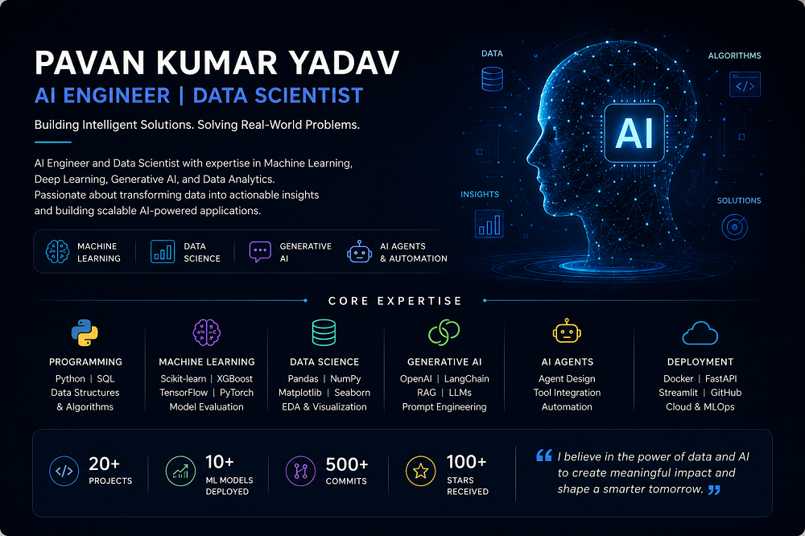

<p align="center">
  
</p>

# PavanKumar Yadav

### AI ML Engineer | Data Scientist | AI Researcher

Building intelligent systems with Machine Learning, Large Language Models, Agentic AI, Retrieval-Augmented Generation, and Data Science.

---

*"Transforming complex data into intelligent products and scalable AI solutions."*

</div>

## About Me

I am an AI Engineer and Data Scientist with 3+ years of experience designing and developing intelligent systems powered by Machine Learning, Deep Learning, Natural Language Processing, Large Language Models, and Agentic AI.

My work focuses on building production-ready AI applications, developing autonomous AI agents, implementing Retrieval-Augmented Generation (RAG) pipelines, integrating Knowledge Graphs, and deploying scalable AI solutions that solve real-world business challenges.

I am passionate about advancing AI capabilities through research, engineering excellence, and continuous learning.

---

## Core Expertise
```
➤ Artificial Intelligence 
➤ Data Science & Analytics 
➤ Machine Learning 
➤ Deep Learning 
➤ Natural Language Processing
➤ Large Language Models (LLMs)
➤ Retrieval-Augmented Generation (RAG)
➤ Agentic AI Systems
➤ Knowledge Graphs
➤ Model Context Protocol (MCP)
➤ AI Application Development
➤ MLOps & Deployment
```
---

## Technical Stack

### Programming Languages

```text
Python
SQL
```

### Machine Learning & Data Science

```text
Scikit-Learn
Pandas
NumPy
TensorFlow
PyTorch
XGBoost
Matplotlib
```

### Generative AI

```text
OpenAI
LangChain
LlamaIndex
Vector Databases
RAG Architectures
AI Agents
Prompt Engineering
Fine-Tuning
```

### Cloud & Engineering

```text
Docker
Git
GitHub
REST APIs
CI/CD
MLOps
```

---

## Areas of Interest

* Autonomous AI Agents
* Multi-Agent Systems
* LLM Reasoning
* Knowledge-Augmented AI
* Enterprise AI Solutions
* AI Research & Development
* Scalable Machine Learning Systems
* Advanced NLP Applications

---

## Professional Highlights

* Developed AI-powered applications leveraging Large Language Models and Retrieval-Augmented Generation.
* Built intelligent agent systems capable of task planning and execution.
* Designed scalable machine learning pipelines for production environments.
* Contributed to AI-driven educational technology solutions.
* Published research exploring reasoning capabilities and Theory of Mind in Large Language Models.
* Strong foundation in Mathematics, Statistics, and Applied Machine Learning.

---

## Current Focus

```text
Building Production-Ready AI Systems
Advanced Agentic Workflows
Large Language Model Applications
Enterprise AI Architecture
Knowledge Graph Integration
Reasoning-Centric AI Research
```

---

## GitHub Statistics


---

## Research & Innovation

My interests extend beyond application development into AI research, particularly:

* LLM Reasoning
* Theory of Mind in AI
* Agentic Systems
* Human-AI Collaboration
* Knowledge-Augmented Intelligence
* Next-Generation AI Architectures

---

## Philosophy

Technology creates value when intelligence is transformed into action.

I strive to build AI systems that are reliable, scalable, interpretable, and capable of solving meaningful real-world problems.

---
## Publications
* https://arxiv.org/abs/2504.15604
* https://arxiv.org/abs/2504.15903
* Python Lib:  https://pypi.org/project/modernbert-doc-cls/

## Demo link
The demo is hosted on a free cloud service and may occasionally be inactive/sleeping due to cloud hosting limitations or platform
1. Computer vision:
- Deployed on HF: https://huggingface.co/spaces/Pavanyadav-111/pothole-detection-system
- Deployed on stremlit: https://pothole-detection-system-ww8cfvptdmjz4sepvmcuwy.streamlit.app/
- Repository Link computer vision:  https://github.com/Pavan-Yadav-git/pothole-detection-system.git

2. AgenticAI-Chatbot: https://huggingface.co/spaces/Pavanyadav-111/pavanchatbot
   
## Connect

LinkedIn: www.linkedin.com/in/pavan-yadav-491b05352

Portfolio: https://pavanyadav-portfolio1.vercel.app/

Email: yadavpavankrr@gmail.com

GitHub: https://github.com/Pavan-Yadav-git

---

<div align="center">

### Open to opportunities in

Artificial Intelligence • Generative AI • Data Science • Machine Learning • Agentic AI • Research Engineering

</div>

